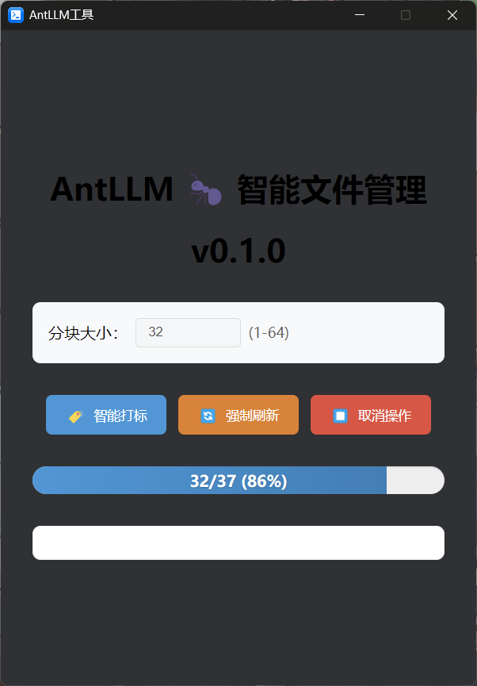

# AntLLM 🐜 **Smart File Manager**  

[中文版](README.md) | [English](README.md)

[//]: # ([![GitHub Stars]&#40;https://img.shields.io/github/stars/yourname/AntLLM?style=flat-square&#41;]&#40;https://github.com/makerlinck/AntLLM&#41;)
[](https://opensource.org/licenses/MIT)

<div align="center">
  
   
  
</div>
---

## Project Overview 📌 | Overview
A smart file management system based on **⚡ FastAPI** and **Deepdanbooru-tagger-mini**, featuring:
- 🖼️ Automated media file archiving and classification
- 🖼️ Smart tracking image source, download, and classification automation
- 🏷️ Intelligent semantic tag generation
- 🚀 Coming soon: Eagle media library integration
- 🚮 Enhanced LangChain integration for extended capabilities

### Technology Stack & Architecture
Frontend-backend separation architecture:
- **Backend**: Built with FastAPI framework, integrated with lightweight image recognition model Deepmini to provide high-performance tagging services.
- **Frontend**: Provides a visual interface via Eagle media library Node.js plugins, supporting tag management and categorized browsing.

```
Future Expansion Plan: Integrate LangChain to build intelligent automated workflows, 
combining multi-modal task processing for full automation from file recognition to semantic analysis and archival.
```

## Core Features 🚀 | Features
#### Key Capabilities
|   **Module**   | **Function Description**          | **Status**   |
|:----------:|-------------------|------|
|  🧠 TAG Engine  | Deepmini image recognition      | ✅ |
| 🏷️ Media Tagging | Deepmini tag generation      | ✅ |
| ⚙ Eagle Plugin  | Plugin support              | ✅ |
| ⚙ Office Plugin | Plugin support              | 🚧 |
|  🧠 AI Engine   | LangChain multi-modal task understanding  | 🚧 |
| 🖼️ File Classification | Semantic-based smart archiving         | 🚧|
| 🖼️ One-click Source Search | Customized search/download/classification workflow | 🚧|
| 🖼️ Visualization UI  | More user-friendly experience     | 🚧|

<div align="start">
  
  
</div>

---

## Quick Deployment ⚡ | Quick Deployment
### Environment Setup | Environment Preparation
Note: This setup is currently for development/debugging only

``` bash
  Install dependencies
$ pip install -r requirements.txt
$ wget https://github.com/KichangKim/DeepDanbooru/releases/download/v4-20200814-sgd-e30/deepdanbooru-v4-20200814-sgd-e30.zip
```
Unzip the file and place contents into `./src/models/Deepmini/resnet-models`

### Basic Usage | Basic Usage
``` bash
-----------------Start Service----------------
uvicorn main:app --host <IP address> --port <Port>
-----------------Run Tests----------------
$ python ./src/test_run_tensorflow.py   # Test TensorFlow
$ python ./src/test_run_deepmini.py     # Test Deepmini
```
Here's a Node.js example for API calls:

``` javascript
async function processChunk(uris, objs) {
  try {
    const response = await fetch('http://127.0.0.1:8000/api/tagger', {
      method: 'POST',
      headers: { 'Content-Type': 'application/json' },
      body: JSON.stringify({ tag_language: DEFAULT_LANGUAGE,query_uris: uris }),
      signal: abortController.signal
    });
    const { response: results } = await response.json();

    results.forEach((item, index) => {
      objs[index].tags = item.img_tags;
      objs[index].save();
      addLog(`已处理: ${objs[index].name}`);
    });
  } catch (error) {
    if (error.name !== 'AbortError') throw error;
  }
}
```
---
## Directory Structure 🌳 | Directory Structure
```text
AntLLM/
├── src/                    - Core source code
│   ├── api/                - API modules
│   │   └── __init__.py
│   ├── core/               - Core functionality
│   │   ├── __init__.py
│   │   └── configure.py
│   ├── models/              - Model files
│   │   ├── deepmini/
│   │   │   ├── resnet-models/ - Tag model files
│   │   │   └── __init__.py
│   ├── schemas/         - Data schemas
│   │   ├── __init__.py
│   │   └── tagger.py    
│   ├── service/         - Service modules
│   │   └── __init__.py
│   ├── utils/           - Utility functions
│   │   ├── constant/    
│   │   │   ├── __init__.py
│   │   │   └── file_manager.py
│   │   ├── __init__.py
│   │   └── main.py      - FastAPI entry point
│   └── settings.py      - Application settings
├── data/                - Data files
│   ├── tagger_model/    - Tag model related files  
│   │   ├── .settings_bak.yaml
│   │   └── settings.yaml
├── docs/                - Project documentation
├── requirements.txt     - Python project dependencies  
└── README.md            - Project overview

```
---

## Contribute The World ! 🤝 | Contribute
Join us by submitting ideas via Issues or contributing code through PRs:

1. Fork the repository
2. Create a feature branch
3. Make your changes
4. Push to your branch
5. Open a Pull Request

We welcome all contributors to help make AntLLM better!

---

## License 📄 | License
This project is licensed under the MIT License
