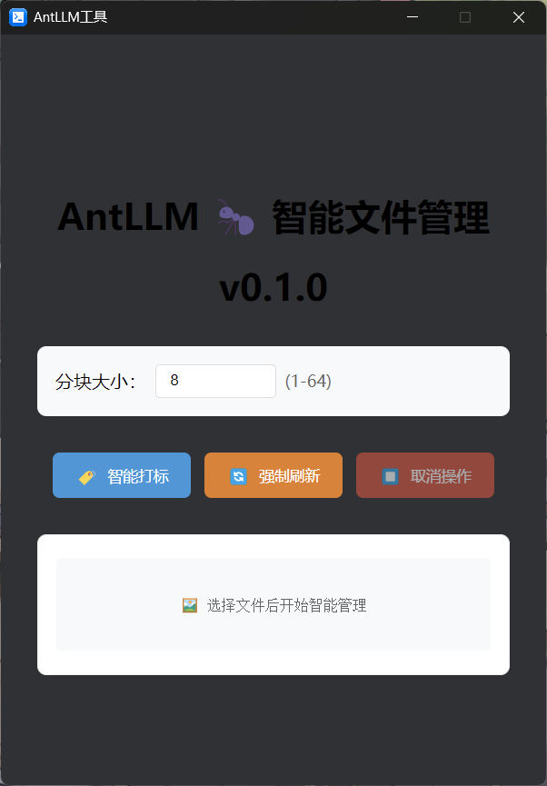
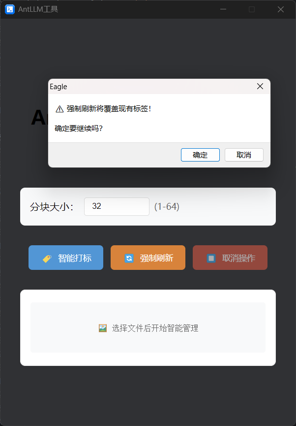
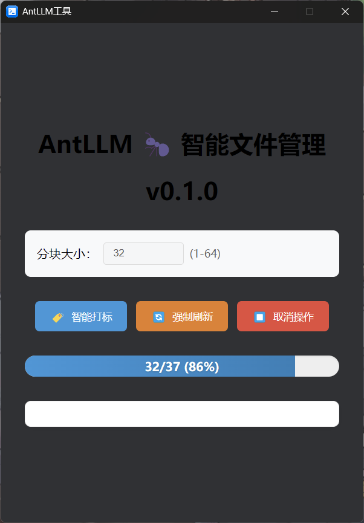

# AntLLM 🐜 **智能图片管家**  

[//]: # ([![GitHub Stars]&#40;https://img.shields.io/github/stars/yourname/AntLLM?style=flat-square&#41;]&#40;https://github.com/makerlinck/AntLLM&#41;)
[](https://opensource.org/licenses/MIT)

<div align="center">
  
   
  
</div>
---

## 项目概述 📌 | Overview
基于 **🦜️🔗 FastAPI ** 和 ** Deepdanbooru-tagger-mini ** 的智能图片管理系统，实现：
- 🖼️ 自动化图片归档分类
- 🏷️ 智能语义标签生成
- 🚀 即将支持 Eagle 媒体库集成
- 🚮 调整Langchian以引入更多功能

## 功能矩阵 🚀 | Features Matrix

#### 核心能力
| 模块 | 功能描述 | 状态 |
|------|----------|----|
| 🧠 AI引擎 | Deepdanbooru+LangChain多模态理解 | ✅  |
| 🖼️ 分类系统 | 基于语义的智能归档 | 🚧  |
| 🔌 Eagle插件 | 原生插件支持 | 🚧  |

---

## 快速部署 ⚡ | Quick Deployment
### 环境准备 | Environment Preparation
注意:该步骤目前仅适用于开发调试
```bash
# 安装依赖
$ pip install -r requirements.txt

# 启动Ollama服务
$ ollama serve
$ ollama pull qwen2.5:3b
$ wget https://github.com/KichangKim/DeepDanbooru/releases/download/v4-20200814-sgd-e30/deepdanbooru-v4-20200814-sgd-e30.zip
```
将deepdanbooru-v4-20200814-sgd-e30.zip解压后的内容放入./deepdanbooru_v4e30文件夹中。
### 基本使用 | Basic Usage
```bash

$ python ./src/test_run_deepmini.py #已弃用
#在第一次运行以后默认会在工作目录产生origin和output文件夹，origin文件夹为原始图片，output文件夹为自动分类后的图片。
# 将原始图片放入origin文件夹中，再次运行即可自动进行分类。


```
以下是node.js实现AntLLM API调用的示例代码：
```
const response = await fetch('http://127.0.0.1:8000/api/tagger', {
      method: 'POST',
      headers: { 'Content-Type': 'application/json' },
      body: JSON.stringify({ tag_language: DEFAULT_LANGUAGE,query_uris: uris }),
      signal: abortController.signal
});
```


## 目录结构 🌳 | Directory Structure

```text
AntLLM/
├── app/                  - 核心源代码
│   ├── api/             - API相关模块
│   │   └── __init__.py
│   ├── core/            - 核心功能模块
│   │   ├── __init__.py
│   │   └── configure.py
│   ├── models/          - 模型相关文件
│   │   ├── deepmini/    - Deepdanbooru剪枝版模块
│   │   │   └── __init__.py
│   ├── schemas/         - 数据模型定义
│   │   ├── __init__.py
│   │   └── tagger.py    - 标签数据模型
│   ├── service/         - 服务相关模块
│   │   └── __init__.py
│   ├── utils/           - 工具函数
│   │   ├── constant/    - 常量定义
│   │   │   ├── __init__.py
│   │   │   └── file_manager.py
│   │   ├── __init__.py
│   │   └── main.py      - FastAPI 主程序入口
│   └── settings.py      - 应用配置文件
├── data/                - 数据文件
│   ├── tagger_model/    - 标签模型相关文件
│   │   ├── .settings_bak.yaml
│   │   └── settings.yaml
├── docs/                - 项目文档
├── requirements.txt     - Python 项目依赖
└── README.md            - 项目说明文档

```

## 参与贡献 🤝 | Contribute
欢迎通过 Issue 提交建议或通过 PR 贡献代码：

- Fork 项目仓库
- 创建特性分支
- 提交修改
- 推送分支
- 发起 Pull Request

## 许可协议 📄 | License
本项目采用 MIT License

