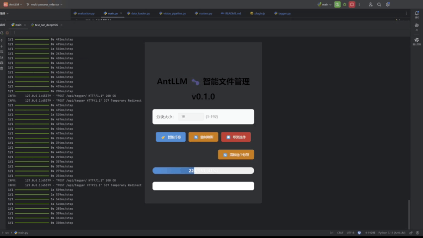

# AntLLM 🐜 **智能文件管家**  

[English](README-EN.md) | [中文版](README.md)

[//]: # ([![GitHub Stars]&#40;https://img.shields.io/github/stars/yourname/AntLLM?style=flat-square&#41;]&#40;https://github.com/makerlinck/AntLLM&#41;)
[](https://opensource.org/licenses/MIT)

<div align="center">
  
   
  
</div>
---

## 项目概述 📌 | Overview
基于 ** ⚡ FastAPI ** 和 ** Deepdanbooru-tagger-mini ** 的智能文件管理系统，实现：
- 🖼️ 自动化媒体文件归档分类
- 🖼️ 图片溯源&下载&分类自动化
- 🏷️ 智能语义标签生成
- 🚀 即将支持 Eagle 媒体库集成
- 🚮 调整Langchian以引入更多功能

### 技术栈与架构
前后端分离架构
- 后端：基于 FastAPI 框架开发，集成轻量级图像识别模型 Deepmini，实现高性能标签生成服务。
- 前端：通过 Eagle 媒体库内置 Node.js 插件 提供可视化交互界面，支持标签管理、分类浏览等核心功能。
```
未来扩展计划:引入 LangChain 构建智能自动化工作流，整合多模态任务处理能力，实现从文件识别、语义分析到文本分类归档的全自动化流程。
```
## 核心功能 🚀 | Features
#### 核心能力
|   **模块**   | **功能描述**          | **状态**   |
|:----------:|-------------------|------|
|  🧠 TAG引擎  | Deepmini图片识别      | ✅ |
| 🏷️ 媒体标签生成 | Deepmini标签生成      | ✅ |
| ⚙ Eagle插件  | 插件支持              | ✅ |
| ⚙ Office插件 | 插件支持              | 🚧 |
|  🧠 AI引擎   | LangChain多模态任务理解  | 🚧 |
| 🖼️ 文件分类系统 | 基于语义的智能归档         | 🚧|
| 🖼️ 一键原图查找 | 自定义搜索&查询&下载&分类工作流 | 🚧|
| 🖼️ 可视化UI  | 更加便捷地使用AntLLM     | 🚧|

<div align="start">
  
  
</div>


## 快速部署 ⚡ | Quick Deployment
### 环境准备 | Environment Preparation
注意:该步骤目前仅适用于开发调试
```bash
# 安装依赖
$ pip install -r requirements.txt

$ wget https://github.com/KichangKim/DeepDanbooru/releases/download/v4-20200814-sgd-e30/deepdanbooru-v4-20200814-sgd-e30.zip
```
将deepdanbooru-v4-20200814-sgd-e30.zip解压后的内容放入./src/models/Deepmini/resnet-models文件夹中。
### 基本使用 | Basic Usage
``` bash
-----------------启动服务----------------
uvicorn main:app --host <IP address> --port <Port>
-----------------测试项目----------------
$ python ./src/test_run_tensorflow.py # 测试tensorflow
$ python ./src/test_run_deepmini.py   # 测试deepmini
 
```
以下是node.js实现AntLLM API调用的示例代码：
``` javascript
async function processChunk(uris, objs) {
  try {
    const response = await fetch('http://127.0.0.1:8000/api/tagger', {
      method: 'POST',
      headers: { 'Content-Type': 'application/json' },
      body: JSON.stringify({ tag_language: DEFAULT_LANGUAGE,query_uris: uris }),
      signal: abortController.signal
    });
    const { response: results } = await response.json();

    results.forEach((item, index) => {
      objs[index].tags = item.img_tags;
      objs[index].save();
      addLog(`已处理: ${objs[index].name}`);
    });
  } catch (error) {
    if (error.name !== 'AbortError') throw error;
  }
}
```


## 目录结构 🌳 | Directory Structure

```text
AntLLM/
├── src/                  - 核心源代码
│   ├── api/             - API相关模块
│   │   └── __init__.py
│   ├── core/            - 核心功能模块
│   │   ├── __init__.py
│   │   └── configure.py
│   ├── models/          - 模型相关文件
│   │   ├── deepmini/
│   │   │   ├── resnet-models/ - 标签模型文件
│   │   │   └── __init__.py
│   ├── schemas/         - 数据模型定义
│   │   ├── __init__.py
│   │   └── tagger.py    - 标签数据模型
│   ├── service/         - 服务相关模块
│   │   └── __init__.py
│   ├── utils/           - 工具函数
│   │   ├── constant/    - 常量定义
│   │   │   ├── __init__.py
│   │   │   └── file_manager.py
│   │   ├── __init__.py
│   │   └── main.py      - FastAPI 主程序入口
│   └── settings.py      - 应用配置文件
├── data/                - 数据文件
│   ├── tagger_model/    - 标签模型相关文件
│   │   ├── .settings_bak.yaml
│   │   └── settings.yaml
├── docs/                - 项目文档
├── requirements.txt     - Python 项目依赖
└── README.md            - 项目说明文档

```

## 参与贡献 🤝 | Contribute
欢迎通过 Issue 提交建议或通过 PR 贡献代码：

- Fork 项目仓库
- 创建特性分支
- 提交修改
- 推送分支
- 发起 Pull Request

## 许可协议 📄 | License
本项目采用 MIT License

